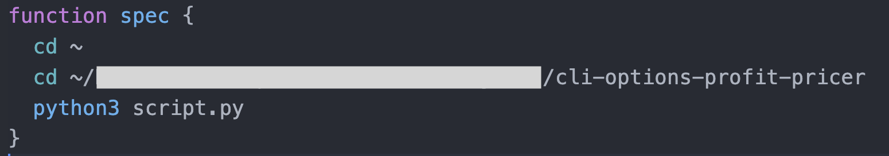
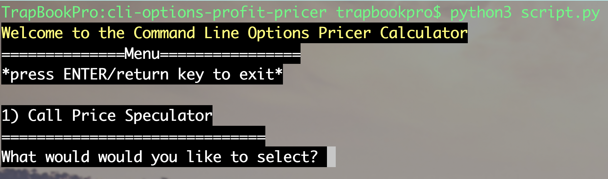
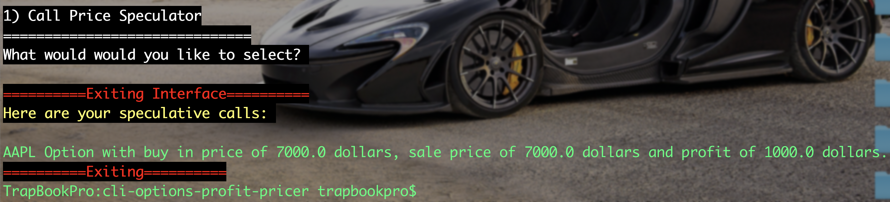

# Welcome to The Command Line Options Profit Calculator

## Quick Profit Calculator for Calls and Puts

This is a profit calculator that I created to help me predict my exit with Call option Positions. This can also be used for Puts, but I primarily do Long Calls.

All you have to do is run the python file in your command line and enter in the desired inputs.

### Begining an entry.

The first thing you want to do is run the python file using `python3 script.py` in your terminal, or set a shortcut using a key word. If you want to exit, use `ctrl/cmd+z`.

### Entering in an Entry

First start by entering a Ticker name. This is just for tracking in the future if you want to enter multiple strategies and choose the best one.

### Entering in a premium purchase price

Enter in the premium purchase price, or the amount you want to purchase your option call for.

### How much do you want to risk?

Enter in the total amount you are willing to put at risk. Note, not all of this money will be used, but this is the maximum amount of money you are willing to put at risk to purchase _x_ amount of contracts.

### Calculate based on percent profit, or the amount you want to have at the end of the trade?

You can calculate how you want to gain from the position you intend on getting into. _NOTE, this is not based on the amount you intend to make, it is based on the amount you intend to have after the trade_

### QUICKSTATS

The `QUICKSTATS` portion combines all of these into an area you can quickly take a glance at.

## Upcoming Functionality

Black Scholes Price calculator where you can put in more exact data. Calling `yfinance` library to get the greeks and calculate the exact price with respect to time of a position to predict what is the optimal price to enter into a trade.

Once barebones is finished in Python, create a web app where users can create an account and keep a log of trades. Thre they can indicate what worked out for them, and a journaling feature can be made. 
